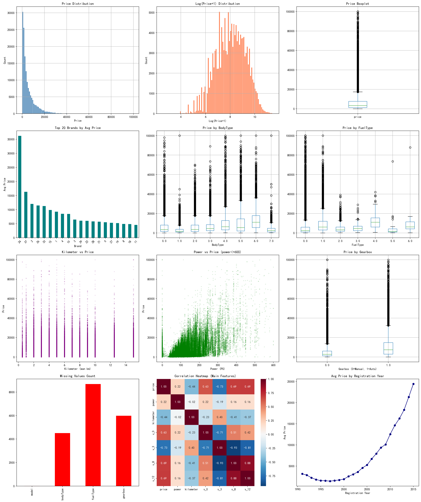
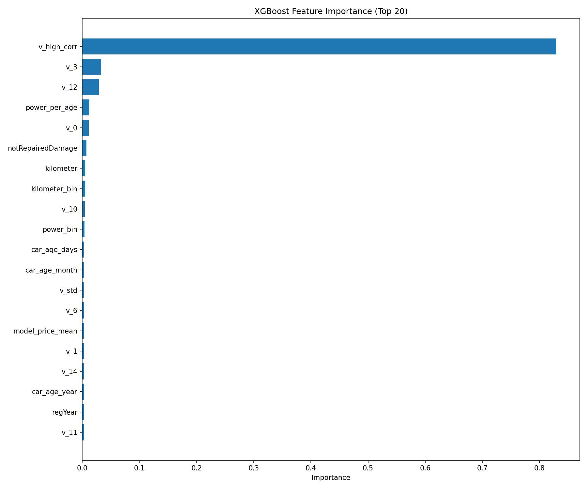

# 天池二手车价格预测

## 比赛简介

- **比赛链接**: [天池二手车交易价格预测](https://tianchi.aliyun.com/competition/entrance/231784/introduction)
- **任务**: 根据二手车的基本属性、配置信息、交易信息等特征，预测二手车的交易价格

## 我的方案

### 数据探索发现



1. **目标变量分布**: Price呈强右偏分布（偏度3.35），需要进行log变换
2. **强相关特征**: V系列匿名特征（v_3, v_12, v_8, v_0）与价格高度相关（|r|>0.6）
3. **缺失值**: fuelType(5.79%)、gearbox(3.99%)、bodyType(3.00%)存在缺失
4. **异常值**: power字段存在0值（8.55%）和超大值（>600）
5. **特殊值**: notRepairedDamage包含"-"标记（16.22%）

### 特征工程

| 特征类别 | 数量 | 主要特征 |
|---------|------|---------|
| 时间特征 | 12 | 车龄(car_age_years)、注册月份、季度等 |
| V系列统计 | 15 | v_mean、v_std、v3_v12_interaction、value_score等 |
| 统计编码 | 14 | brand_price_mean、model_price_median等（基于训练集计算防止泄露）|
| 其他衍生 | 6 | power_per_age、km_per_year等 |

**关键处理**:
- 目标变量: log1p变换处理右偏分布
- power异常值: 0值用中位数填充，>600截断
- notRepairedDamage: "-"转为NaN
- 缺失值: 数值型用中位数填充，类别型用众数填充

### 模型探索

尝试了三种主流GBDT模型进行对比：

| 模型 | 5-Fold CV MAE | 标准差 | 训练时间 | 备注 |
|------|---------------|--------|----------|------|
| **CatBoost** | **476.53** | 5.03 | ~3.5h | 最终选择 |
| LightGBM | 516.23 | 1.94 | ~25min | 训练最快 |
| XGBoost | 511.25 | - | ~1h | 效果一般 |

**最终选择CatBoost**，原因：
- MAE最低，预测精度最高
- 原生支持类别特征，无需手动编码
- 对过拟合有更好的控制



### 调参策略

采用经验参数 + 早停策略：
- `iterations=10000`, `early_stopping_rounds=200`
- `learning_rate=0.05`, `depth=8`
- `l2_leaf_reg=10`, `min_data_in_leaf=50`
- 5折交叉验证，`random_state=42`

## 成绩

- **最终得分**: 470.73
- **排名**: 297 / 2752 (Top 11%)

## 如何运行

### 环境要求

```bash
pip install -r requirements.txt
```

### 快速开始

**方式一: 运行Jupyter Notebook（推荐）**
```bash
jupyter notebook used_car_price_prediction.ipynb
```

**方式二: 分步运行脚本**
```bash
# 1. 数据预处理
python data_preprocessing.py

# 2. 特征工程
python feature_engineering.py

# 3. 模型训练（三选一）
python train_catboost.py   # CatBoost模型 (推荐)
python train_lightgbm.py   # LightGBM模型
python train_xgboost.py    # XGBoost模型
```

### 项目结构

```
├── used_car_price_prediction.ipynb  # 完整流程Notebook
├── eda_analysis.py                  # EDA分析脚本
├── data_preprocessing.py            # 数据预处理脚本
├── feature_engineering.py           # 特征工程脚本
├── train_catboost.py                # CatBoost训练脚本
├── train_lightgbm.py                # LightGBM训练脚本
├── train_xgboost.py                 # XGBoost训练脚本
├── requirements.txt                 # Python依赖
├── submission.csv                   # 最终提交文件
├── eda_visualizations.png           # EDA可视化图
├── feature_importance.png           # 特征重要性图
└── used_car_train_20200313.csv      # 原始训练数据
```

## 改进方向

- [ ] 模型融合（Stacking/Blending）
- [ ] 超参数调优（Optuna/Hyperopt）
- [ ] 更多特征交互组合
- [ ] 尝试神经网络模型

## License

MIT License
